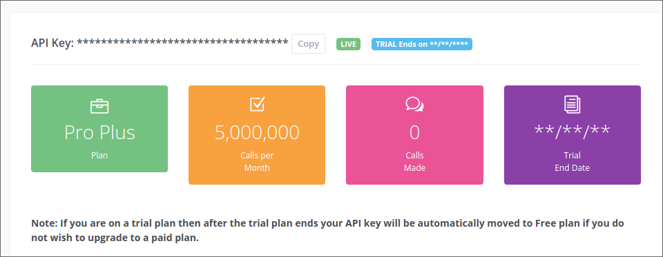

# skycast

Sky Cast, to check your prefer localization weather

##  Technical information

flutter version: **3.16.0 or 3.16.4**
(optional but **recommended**) docker: **24.0.7**
(if doesn't have docker installed) GnuPG: **latest version**

## Getting Started

### 0-) [if you don't have docker installed] install GnuPG

on macOS is ease with:
```bash
brew install gnupg
``` 

### 1-) Create an account on weatherapi.com



> :information_source: (optional) create a google api key to get suggestions of places when looking for locations https://console.cloud.google.com/apis/credentials?hl=en&project=(yourprojectname)

###  2-) copy the env.example an name it env
``` bash
cp env.example env
```

#### 2.1-) Setup the env variables

```bash
ENV=production  
API_KEY= #get your api key from weatherapi.com
BASE_URL_WEATHER=api.weatherapi.com  
PREFIX_URL_WEATHER=/v1  
PATH_FORECAST=/forecast.json  
PATH_CONDITION_TRANSLATIONS=/docs/conditions.json  
  
GOOGLE_MAPS_API_KEY= # get your google api key from the GCP of your own account
PATH_TO_GET_SUGGESTIONS_FOR_DIRECTIONS=/maps/api/place/autocomplete/json  
BASE_URL_TO_GET_MAP_DIRECTIONS=maps.googleapis.com
``` 
###  3-) Recreate the keystore
> :warning:  I have test this command only with linux and macos

> :information_source:  Run this comman inside the root project path
```bash
docker compose -f build_key_store/docker-compose.yml up -d && docker compose -f build_key_store/docker-compose.yml down && docker compose -f build_key_store/docker-compose.yml rm -fsv && docker image rm build_key_store-app
```
If you don't have **docker** installed, then just run this command (make sure yourself that to install the **GnuPG** dependency in your machine)
> :information_source:  Run this comman inside the root project path
```bash
gpg -d --passphrase "nikenikenike" --batch android/app/skycastApp.jks.asc > android/app/skycastApp.jks
```

and then, you are good to go.